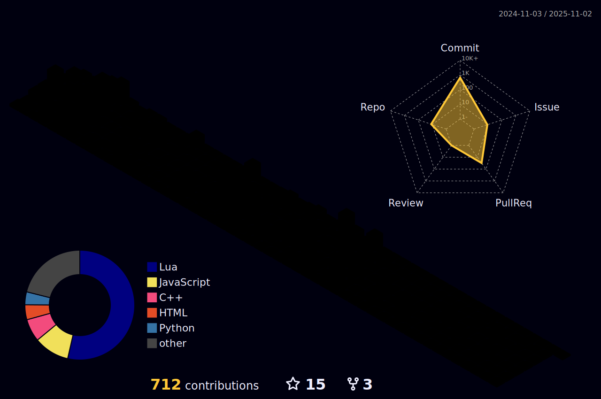

<!-- [](https://git.io/typing-svg) -->
<div align="left" style="margin-bottom: 10px;">
  <a href="https://git.io/typing-svg">
    
  </a>
</div>

<table align="center">
  <tr>
    <td align="center" width="33%">
      <a href="https://discord.com/users/908932551278727168">
        
      </a>
    </td>
    <td align="center" width="33%">
      <a href="https://dreamhack.io/users/82881" target="_blank" rel="noopener noreferrer">
        
      </a>
    </td>
    <td align="center" width="33%">
      <a href="https://dreamhack.io/users/82881" target="_blank" rel="noopener noreferrer">
        
      </a>
    </td>
  </tr>
</table>

<!--
```
                                          .-/+oossssoo+/-.
                                      `:+ssssssssssssssssss+:`
                                    -+ssssssssssssssssssyyssss+-
                                  .ossssssssssssssssssdMMMNysssso.
                                 /ssssssssssshdmmNNmmyNMMMMhssssss/
                                +ssssssssshmydMMMMMMMNddddyssssssss+
                               /sssssssshmmmmhhhyyyyhmNMMMNhssssssss/
                              .ssssssssdMMMNhsssssssssshNMMMdssssssss.
                              +sssshhhyNMMNyssssssssssssyNMMMysssssss+
                              ossyNMMMNyMMhsssssssssssssshmmmhssssssso
                              ossyNMMMNyMMhsssssssssssssshmmmhssssssso
                              +sssshhhyNMMNyssssssssssssyNMMMysssssss+
                              .ssssssssdMMMNhsssssssssshNMMMdssssssss.
                               /sssssssshmmmhyhhyyyyhdNMMMNhssssssss/
                                +sssssssssdmydMMMMMMMMddddyssssssss+
                                 /sssssssssssssdmyddsMMMMMdyssssas/
                                   +sssssssssssssssssssdMMNMsssss/
                                    -+ssssssssssssssssssyysssss+-
                                     -:+sssssssssssssssssssss+:-
                                         .-/+ossossososso+/-.
```
-->

Hi there! I'm Tran Ly Nhat Hao (Hao Tran), a junior at [VNUHCM - University of Science](https://hcmus.edu.vn/) [[FIT](https://www.fit.hcmus.edu.vn/)], from Vietnam.<br>
I'm now searching for work in software engineering and machine learning. My goal is to put my creativity, programming, and project management talents to work.<br>
I am open to collaborating on innovative projects, and you can reach me at <nhathao.tranly.cs@gmail.com> for any inquiries or potential collaborations. Feel free to connect with me on [LinkedIn](https://www.linkedin.com/in/tranlynhathao/) or visit [my personal webpage](https://tranlynhathao.github.io) to learn more about my work and ongoing projects.

<div align="center">

  <picture>
    <source srcset="https://raw.githubusercontent.com/tranlynhathao/github-stats/master/generated/overview.svg#gh-dark-mode-only" media="(prefers-color-scheme: dark)">
    
  </picture>

  <picture>
    <source srcset="https://raw.githubusercontent.com/tranlynhathao/github-stats/master/generated/languages.svg#gh-dark-mode-only" media="(prefers-color-scheme: dark)">
    
  </picture>

</div>

<!--
---


---
-->

<!-- [](https://instagram.com/nhathao0402) -->

<!-- # 📊 GitHub Stats:
<br/>
<br/>
 -->

<!-- <p align="center">


</p> -->

<!-- ## 🏆 GitHub Trophies
[](https://github.com/ryo-ma/github-profile-trophy) -->

<!--### 🔝 Top Contributed Repo
 -->

<!--
<p align="center">
 
</p> -->

<!-- --- -->

<!--  -->
<!-- <a href="https://github.com/antonkomarev/github-profile-views-counter">  </a> -->
